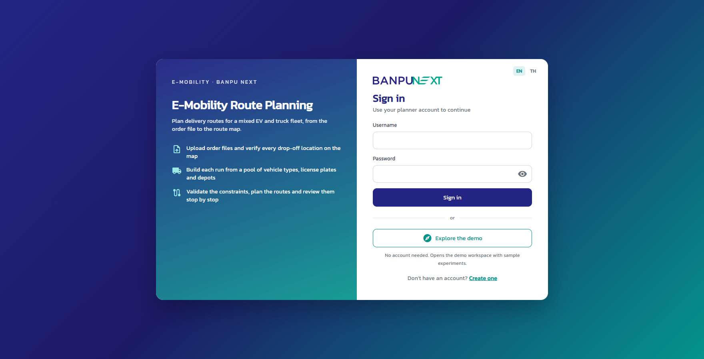
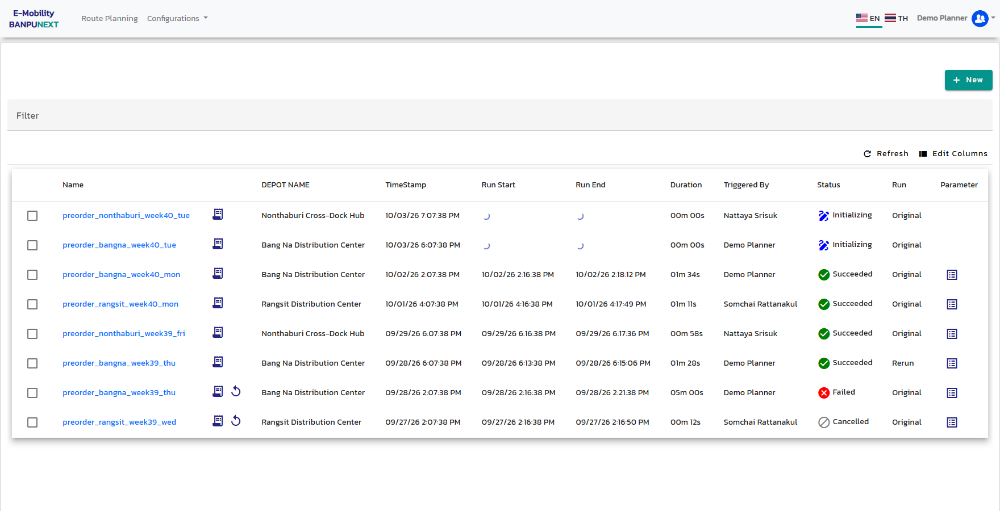
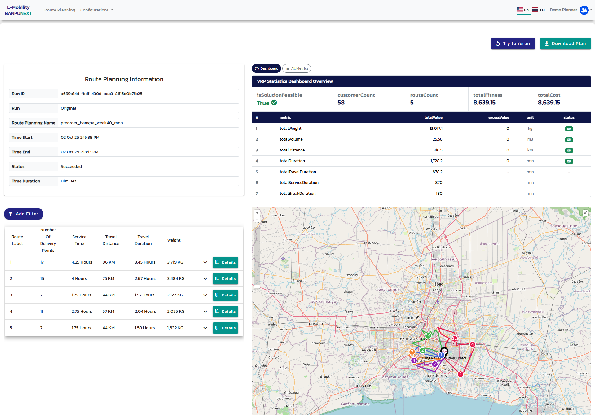

# E-Mobility Route Planning — Banpu NEXT

<p align="center">
  
  
</p>
<p align="center">
  
</p>

Route planning for a mixed EV and truck delivery fleet: upload the day's orders, check every drop-off on
the map, pick vehicles from the pool, validate the constraints and get the routes back stop by stop.

## Summary

| | |
| --- | --- |
| **Frontend** | Angular 18, Apollo Client, OpenLayers, Transloco (EN/TH) — `app/frontend` |
| **Backend** | Node.js, Express 5, PostgreSQL, JWT; GraphQL for the app data + REST for auth and files — `app/backend` |
| **Auth** | Username and password. Access token (15 min, kept in memory) + rotating refresh token in an HttpOnly cookie. Every API call needs the access token, GraphQL and file downloads included. |
| **Guest entry** | A visitor with no session is signed in as the seeded demo account and lands on the experiments page. Logging out shows the login and register pages. |
| **File storage** | Local disk in development, Cloudflare R2 with one env switch. |
| **Planning** | The original planning service is closed, so the API simulates it: geocoding, validation and a VRP heuristic produce real routes for the map. |
| **API tools** | Altair GraphQL explorer at `/altair`, Swagger UI at `/docs`. |

## Run it locally

Needs Node.js 22+ and Docker.

```bash
# API — http://localhost:4000
cd app/backend
cp .env.example .env     # set PASSWORD_PEPPER and TOKEN_SECRET (32+ characters each)
docker compose up -d     # PostgreSQL on 127.0.0.1:5433, Adminer on 127.0.0.1:8081
npm install
npm run migrate:up
npm run seed             # demo company, accounts, depots, vehicles, 8 experiments, sample files
npm run watch

# Web app — http://localhost:4200 (proxies /api to :4000)
cd app/frontend
npm install
npm start
```

Open <http://localhost:4200>: it goes straight to the experiments page as the demo planner.

| URL | |
| --- | --- |
| <http://localhost:4200> | Web app |
| <http://localhost:4000/altair> | Altair, already signed in as the demo account, sample operations open as tabs |
| <http://localhost:4000/docs> | REST reference |
| <http://localhost:8081> | Adminer (server `postgres`, user `emob_user`, database `emob_dev`) |

**Accounts.** `npm run seed` creates `demo` (planner) and `admin`. Their passwords are `DEMO_PASSWORD` and
`ADMIN_PASSWORD` from `.env`; leave them empty and the seed generates and prints them once. Guest entry
needs no password, and the register page creates more planners in the same demo company.

**Try a run.** New → upload `app/backend/sample-data/preorder_bangna_sample.xlsx` → add vehicles → Validate →
Plan My Route. `npm run seed` again restores the demo data at any time.

## Backend flow

### 1. Sign-in and tokens

```
POST /api/v1/auth/login | register | demo
        │  bcrypt check (password + pepper)
        ▼
{ user, accessToken }            → kept in memory by the web app, sent as  Authorization: Bearer …
Set-Cookie: refreshToken=…       → HttpOnly, Path=/api/v1/auth, never readable from JavaScript

401 token_expired  →  POST /api/v1/auth/refresh (cookie)  →  new access token + new cookie  →  retry
```

- The refresh token rotates on every use. A retired token that comes back revokes the whole session.
- `POST /auth/demo` issues the same kind of session for the demo account, so guests still call the API
  with an access token like everyone else. Switch it off with `DEMO_LOGIN_ENABLED=false` (API) and
  `auth.autoDemoLogin: false` (`app/frontend/src/environments`).

### 2. Every request

```
Angular ──► /api/v1/graphql   (queries, mutations, multipart uploads)
        ──► /api/v1/files/*   (order files, configuration files, plan results)
              │
              ▼
helmet · CORS · rate limit ─► verify JWT ─► load user, role and company from the database
              │
              ▼
resolver / controller ─► service ─► repository (SQL scoped by company_id)
                                 └► storage  (local disk | Cloudflare R2)
```

The role and the company always come from the database, never from the token or the request, so a
planner only ever reads and writes their own company's rows and files.

### 3. Planning a run

| Step | GraphQL | What the API does | Status |
| --- | --- | --- | --- |
| Create | `createExperiment` | Opens a draft owned by the caller | `Initializing` |
| Upload | `uploadPreOrder` | Stores the files, checks columns and rows, geocodes addresses without coordinates, flags uncertain locations | `Initializing` |
| Validate | `validateExperiment` | Applies location fixes, builds the fleet from the vehicle pool, checks weight, volume, time and distance limits, reports missing products | `Initializing` |
| Plan | `submitExperiment` | Queues the run; the runner solves it (sweep + nearest neighbour + 2-opt, time windows, breaks) and writes the plan files and the result workbook | `Queued` → `InProgress` → `Succeeded` / `Failed` |
| Review | `experiment`, `downloadResultFile` | Returns the URLs of the stats, GeoJSON and workbook, read through `/api/v1/files` | |

`rerunExperiment`, `cancelExperiment` and `replicateExperiment` retry, stop or copy a run. Runs that were
queued when the server stopped are picked up again on start.

### 4. Files and Cloudflare R2

Every uploaded or generated file goes through one storage service with two drivers. To move from local
disk to R2, fill these in `app/backend/.env` and restart:

```bash
STORAGE_DRIVER=r2
R2_ACCOUNT_ID=your_cloudflare_account_id
R2_ACCESS_KEY_ID=your_r2_access_key_id
R2_SECRET_ACCESS_KEY=your_r2_secret_access_key
R2_BUCKET=your_r2_bucket_name
```

Keys look like `companies/<companyId>/experiments/<runId>/plan/geoJson.json`. The bucket stays private:
the browser never receives a bucket URL, files are streamed by `GET /api/v1/files/<key>` behind the access
token, and a key outside the caller's company answers `404`.

### API surface

| | |
| --- | --- |
| **REST** | `POST /api/v1/auth/{register,login,demo,refresh,logout,logout-all}`, `GET /api/v1/auth/me`, `GET /api/v1/files/*`, `GET /healthz` |
| **GraphQL — experiments** | `experiments`, `experiment`, `downloadResultFile`, `createExperiment`, `uploadPreOrder`, `validateExperiment`, `submitExperiment`, `rerunExperiment`, `cancelExperiment`, `replicateExperiment` |
| **GraphQL — master data** | `myCompany`, `myDepots`, `configurations`, `configuration`, `actualLocation`, `uploadActualLocation`, `replaceTypeOfCategory` |
| **GraphQL — vehicles** | `myVehicleTypes`, `myVehicleType`, `myVehicles`, `myVehicle`, `getEnumValues`, create / update / delete for vehicle types and vehicles, `softDeleteVehicle` |
| **GraphQL — parameters** | `dynamicParameters`, `dynamicParameter`, `myParameter`, `parameter`, `updateDynamicParameter`, `updateParameter`, `deleteDynamicParameter` |

**Altair.** `/altair` is bundled with the API. For the Altair desktop app, import
`app/backend/altair/emob-api.agc` (Collections → Import) and set the `accessToken` environment variable
to a token from `POST /api/v1/auth/login`. `npm run altair:collection` regenerates the file.

### Security

- Passwords: HMAC-SHA256 pepper, then bcrypt. Login answers the same for an unknown user and a wrong password.
- Tokens: HS256 pinned on sign and verify, 15-minute access token, refresh rotation with reuse detection.
- Access: role and company re-read on every request, every query scoped by company, drafts editable by their creator only.
- Limits: per-IP rate limits (tighter on sign-in), body and upload size caps, GraphQL depth limit.
- Errors: validation messages for the caller's mistakes, opaque `500`s, request id on every response.
- Audit log: sign-ins, failed sign-ins and every mutation.

## Scripts

| Backend (`app/backend`) | |
| --- | --- |
| `npm run watch` / `npm run build && npm start` | Run in development / production |
| `npm run migrate:up` / `migrate:down` / `migrate:reset` | Database migrations |
| `npm run seed` (`seed:prod` from a build) | Rebuild the demo data and `sample-data/` |
| `npm test` | API and unit specs against the `emob_test` database |
| `npm run lint` / `typecheck` / `format` | ESLint, TypeScript, Prettier |

| Frontend (`app/frontend`) | |
| --- | --- |
| `npm start` | Dev server with the API proxy |
| `npm run build` | Production build |
| `npm test` / `npm run lint` | Karma unit tests, ESLint |

## Project structure

```
app/
├── backend/
│   ├── migrations/          SQL migrations (db-migrate)
│   ├── sample-data/         order files to upload in the demo
│   ├── altair/              Altair collection of the GraphQL operations
│   ├── openapi.yaml         REST reference served at /docs
│   └── src/
│       ├── routes/ controllers/ middleware/   REST: auth, files, docs, Altair
│       ├── graphql/         schema, resolvers, uploads, error formatting, depth limit
│       ├── services/        auth, experiments, vehicles, parameters, configurations
│       │   ├── pipeline/    transform, validation, solver, plan files
│       │   └── storage/     local and R2 drivers
│       ├── repositories/    SQL
│       ├── scripts/         seed, Altair collection export
│       └── tests/           API and unit specs
└── frontend/
    └── src/app/
        ├── core/            session, token refresh, guards, interceptor, GraphQL client, logger
        ├── layout/          frame around the signed-in pages (top bar, page outlet)
        ├── shared/          dialogs, form controls, pipes, directives, Material module
        └── features/
            ├── auth/            login, register, unauthorized
            ├── experiment/      experiment list, run and result pages
            │   ├── run/         upload file, order data, vehicle, parameter, validation, map
            │   └── result/      route information, dashboard, filter, route table, map
            └── configurations/  master data upload, vehicle management
```

Inside `src/app`, imports that cross a folder boundary use the `@core/*`, `@shared/*` and `@features/*`
aliases (`@env/*` for `src/environments`); imports within one feature stay relative.

## Deploying

- **API** — `app/backend/Dockerfile` (with a `railway.json`): migrations run before each deploy, and
  `npm run seed:prod` loads the demo data from inside the container. Use `STORAGE_DRIVER=r2` wherever the
  disk does not survive a redeploy.
- **Web app** — it calls the relative paths `/api/…`. Either serve both behind one origin (reverse proxy
  `/api` to the API), or set `apiConfig.uri` and `graphqlConfig.uri` in `environment.prod.ts` to the API
  origin and, on the API, `ENV=production`, `ALLOWED_ORIGIN=<web origin>` and `PUBLIC_BASE_URL=<API origin>`.
